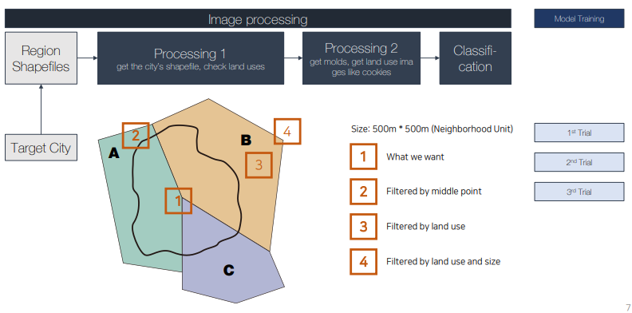

# UPSUZ: **The standardized benchmark dataset for AI-based urban zoning researches in Korea**

> AI기반 토지이용계획 자동화를 위한 벤치마크 데이터셋 제작. 한국의 토지이용을 나타내는 raw data들을 검토하고, 근린주구 3~4개에 대한 답을 내릴 수 있는 사이즈를 평가하여 Shapefile을 이미지 파일로 가공, AI 활용 예시 탐구.
> 

## 1. 프로젝트 개요

- 개발 기간: 2021.09. - 2022.02.
- 참여 인원: 개인 프로젝트
- 맡은 역할: raw 데이터 검토, 데이터 전처리 및 가공
- 활용 데이터: 공공데이터포털 국토교통부 토지특성도 Shapefile
- 사용 기술 / 데이터 분석 방법:
    - Python (GeoPandas, Shapely, Pillow) / OpenCV / TensorFlow

## 2. 프로젝트 핵심 내용 및 역할

- 공간 데이터 전처리 및 가공
    - 프로젝트 설명
        - AI기반 토지이용계획 자동화를 위한 벤치마크 데이터셋을 제작하는 프로젝트이다.
            - 우리나라 토지 이용 관련 데이터는 Overlay Zoning의 발달로 무수히 많은 특성을 동시에 가지고 있어 전처리하기 어렵다.
            - 연구의 용이함과 기준 모델 성능의 기준을 만들고자 토지 정보 데이터를 이미지 데이터로 가공하였다.
    
    - 진행사항
        - 한국의 토지이용을 나타내는 raw data 검토 및 활용 데이터 파악
        - Shapefile data를 Image file로 변환하여 가공, Data Filtering 진행
        
        
        
        
        
        - 벤치마크 데이터셋을 GAN 모델에 적용하는 실험 수행, Data Augmentation으로 모델 성능 향상 및 예시 결과 도출
        
        
        
        - GAN 실험 결과: Question - Answer from AI - Real Answer
        
        (Code source: [https://github.com/affinelayer/pix2pix-tensorflow](https://github.com/affinelayer/pix2pix-tensorflow))
        
        
        

## 3. 프로젝트 핵심 성과

- 1차로 10개 신도시에 대해 24,164개의 토지이용계획 데이터 생성
- 데이터의 품질을 높이기 위한 가공 진행중
- 33 KKHTCNN 2022에서 발표예정 (2022.11.17.-19., Singapore)